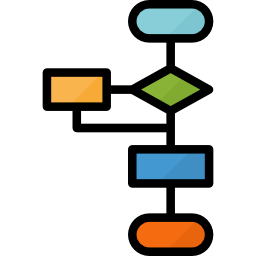
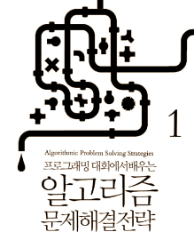

# Self-taught Algorithm Study
- This is repository on studying algorithm and data structure, and recording useful documents, source codes, papers, and links, etc. 

# What is an Algorithm?
- The algorithm is a reasonable specification to solve a given problem.

    

# Why do you make this repository?
- Through trial and error, I want to provide everyone to be interested in algorithm and data structure with the most efficient study road map.

# [Uploaded Algorithms List](Codes/)
- **Brute force**
  - [Max sum, <i>O(N3)</i>](Codes/MaxSum1.cpp)
  - [Max sum, <i>O(N2)</i>](Codes/MaxSum2.cpp)
  - [Wild card, <i>O(N3)</i>](Codes/WildCard1.cpp)
  - [LIS(Longest Increasing Subsequence), <i>O(N3)</i>](Codes/LIS1.cpp)
  - [Recursive sum, <i>O(N)</i>](Codes/RecursiveSum.cpp)
  - [Paring, <i>O(∏(2n-1))</i>](Codes/Picnic.cpp)
    - [input file](Inputs/Picnic.txt)

- **Divide and Conquer**
  - [Max sum, <i>O(NlogN)</i>](Codes/MaxSum3.cpp)
  - [Big number multiplication using Karatsuba Algorithm, <b><i>O(Nlog3)</i></b>](Codes/KaratsubaFastMultiplication.cpp)
  
- **Dynamic Programming**
  - [Max sum, <b><i>O(N)</i></b>](Codes/MaxSum4.cpp)
  - [Wild card, <i>O(N3)</i>](Codes/WildCard2.cpp)
  - [Wild card, <b><i>O(N2)</i></b>](Codes/WildCard3.cpp)
  - [Triangle path, <i>O(2n)</i>](Codes/TrianglePath1.cpp)
  - [Triangle path, <b><i>O(N2</b>)</i>](Codes/TrianglePath2.cpp)
  - [LIS(Longest Increasing Subsequence), <i>O(N2)</i>](Codes/LIS2.cpp)
  - [LIS(Longest Increasing Subsequence), <i>O(N2)</i>](Codes/LIS3.cpp)
  - [JLIS(Joined Longest Increasing Subsequence), <i>O(N3)</i>](Codes/JLIS.cpp)

- **Mathematics**
  - [Prime factorization, <i>O(size of number)</i>](Codes/PrimeFactorization.cpp)
  - [Moving average, <i>O(N*M)</i>](Codes/MovingAverage1.cpp)
  - [Moving average, <b><i>O(N)</i></b>](Codes/MovingAverage2.cpp)
  - [Big number multiplication, <i>O(N2)</i>](Codes/BigNumberMultiplication.cpp)
  
- **Sort**
  - [Insertion sort, <b><i>O(N2</b>)</i>](Codes/InsertionSort.cpp)
  - [Selection sort, <b><i>O(N2</b>)</i>](Codes/SelectionSort.cpp)

- **Search**
  - [Sequential search, <b><i>O(N)</i></b>](Codes/SequentialSearch.cpp)
  - [Binary search, <b><i>O(logN)</i></b>](Codes/BinarySearch.cpp)

# Time Complexity Graph

    

from <i>https://en.wikipedia.org/wiki/Time_complexity</i>

# Useful sites
-  Problem Solving
    - **Topcoder**
      - https://www.topcoder.com/community/competitive-programming/

    - **BOJ(Baekjoon Online Judge, <i>Korean</i>)**
      - https://www.acmicpc.net/

    - **Codeforces**
      - https://codeforces.com/

    - **HackerRank**
      - https://www.hackerrank.com/

    - **Codeground**
      - https://www.codeground.org/
  
# Reference
[Korean books]

    
    

